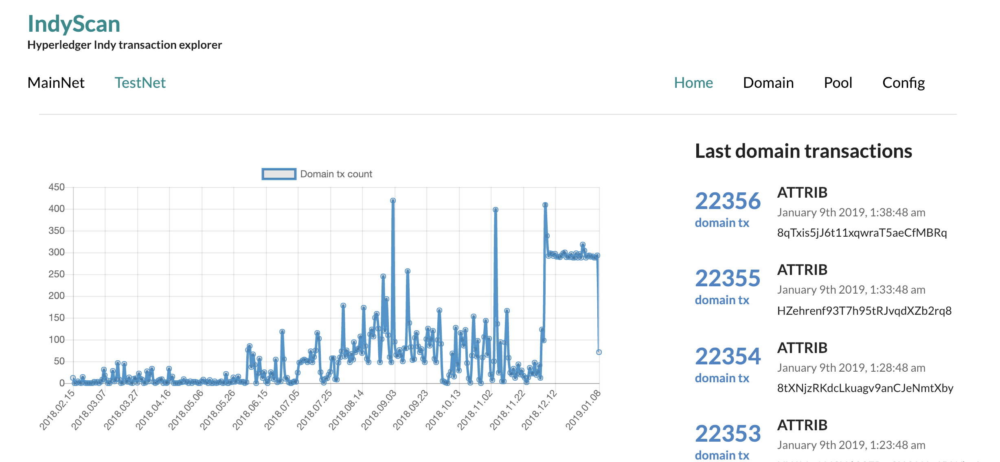

# Indyscan
### Hyperledger Indy Transaction explorer


# How it works
The daemon is periodically looking for new transactions. When new transaction is found, it's
stored in MongoDB. 

The WebApp queries MongoDB and displays the data. You can browse public Sovrin blockchain at [https://indyscan.io](https://indyscan.io).




# Getting started
You have 2 main options:

1.  **IndyPool + IndyScan [locally](start)**

  The easiest way to get started with Indy. Spins up Indy network locally with IndyScan explorer
    hooked up to the network out of the box. 

2. **IndyPool + IndyScan in [cloud](./start-aws)**
  
  Good for development or sharing private browseable ledger with your coworkers.  

# DEV
Following is for those who want to contribute or tweak the code. Here's how to set up your native environment. So far only tested on Mac OS.

## Structure
```
- start/               - automation to startup IndyScan (and optionally IndyPool)
- indyscan-api/        - http client to call indyscan api
- indyscan-webapp/     - nextjs web app
- indyscan-daemon/     - process looking for a new transactions
- indyscan-storage/    - shared library for app and daemon
- indyscan-txtype/     - shared library contaning information about indy tx types
- ubuntu-libindy/      - base docker image for daemon docker image
- build-all.sh         - script to build all the code into docker images
- docker-compose.yml   - for running indyscan locally in containers
```

## Mongo
Startup your mongoDb instance. You can use Docker, and in such a case I recommend mount its data directory somewhere on your host, so you don't loose previously scanned transactions if you kill your mongo container.
`docker run --name local-indyscan-mongo -p 27017:27017 -v ~/indyscan/mainnet:/data/db -d mongo:3.4.18`

## Indyscan daemon
First ou need to make sure you've have compiled libindy for your system. Follow instructions on https://github.com/hyperledger/indy-sdk to do this.
Startup transaction scanner daemon. In the `daemon` directory, run
```
npm install
```
Before you run daemon, the directory `~/.indy_client/pool` in your machine should contain pool configurations. For example, in my case it contains these:
```
> ls ~/.indy_client/pool
SOVRIN_MAINNET SOVRIN_TESTNET
```
And each of these 2 directories contains genesis transactions for given network. If you don't have any pool configurations, you can quickly generate configurations for sovrin testnet and mainnet by running
```
npm run networks:add:sovrin
```
When we start indyscan daemon, we need to asur that variable `INDY_NETWORKS` is exported. It's value should be list of pool names separated by comma, matching pool names in your `~/.indy_client/pool` directory. 
So for example, given content of my `~/.indy_client/pool` shown in example above, I would start running daemon against these pool like this: 
```
INDY_NETWORKS="SOVRIN_MAINNET,SOVRIN_TESTNET" npm run start
```
If everything falls in place, daemon will open connections to pools listed in `INDY_NETWORKS` environment variable based on their configuration inside `~/.indy_client/pool` directory and start polling transactions from the 1st until the last.
By default it fetches 2tx/per sec/per pool and slows down polling frequency once it discovers there's no more transactions left. Each transaction is saved to mongodb. 

## Webapp
Webapp reads tx data from mongo and presents it. You have to pass in the `INDY_NETWORKS` the same way like in case of the `daemon` so it knows which pools it should display. The first pool name specified in `INDY_NETWORKS` will be displayed on homepage
by default.
```
cd app;
npm install
INDY_NETWORKS="SOVRIN_MAINNET,SOVRIN_TESTNET" npm run dev
```
